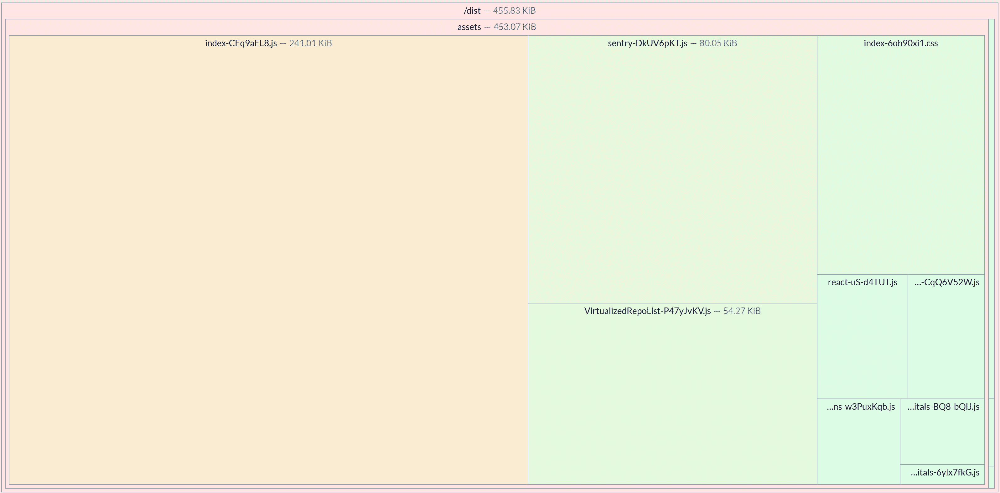

# GitHub User Search

A React application for searching GitHub users and browsing their repositories.

[Live demo on Vercel: https://showcase-search-pwa.vercel.app/](https://showcase-search-pwa.vercel.app/)

[Code](https://github.com/Zulcom/showcase-search-pwa)

Bundle before any compression:


## Tech Stack

- Frontend: React 19, TypeScript 5.7, Vite 6
- Styling: Panda CSS, Park UI, Ark UI
- Testing: Vitest, Testing Library, Playwright
- PWA: Service Workers, Workbox
- Code Quality: OxLint (for speed, not compatible with prod), Prettier, React Compiler
- CI/CD: Github Actions & Pages (Switched to Vercel since Pages are paid)

## Installation

no need configuring, but Sentry DSN and GitHub token welcomed

```bash
cp .env.example .env.local
npm install
npm run dev
```

The app will be available at `http://localhost:5173`

## Scripts

- `npm run dev` — start development server
- `npm run build` — build for production
- `npm run preview` — preview production build
- `npm run lint` — lint code with OxLint
- `npm run format` — format code with Prettier
- `npm run test` — run unit tests
- `npm run test:watch` — run tests in watch mode
- `npm run test:coverage` — run tests with coverage
- `npm run test:e2e` — run E2E tests with Playwright
- `npm run test:e2e:coverage` — run E2E tests with code coverage

## Testing

### Unit Tests

```bash
npm run test
npm run test:coverage
```

### E2E Tests

```bash
npm run test:e2e
npm run test:e2e:coverage
```

## CI/CD

GitHub Actions pipeline runs lint, build, tests, and deploys to GitHub Pages.

## Showcase Your Skills:

> Use this project as an opportunity to demonstrate your best work, whether it's in UI/UX, state management, testing, or
> code architecture.

Thank you for the opportunity!

Here we have:

- React 19 + Compiler for performance
- Zero runtime CSS-in-JS, Defensive CSS, dark mode, animations
- Lazy loading
- handwritten (!) API types generation (openapi gen exists, but whole Github spec create ton of a code and there is no
  easy way to ask for a specific types)
- LRU cache with TTL for API response caching with automatic invalidation via localStorage.
- Offline support via PWA with Service Workers
- React hooks only state management with ease
- List virtualization with react-virtuoso for efficient rendering of large lists. Statistically, most of GitHub users
  has less than 5 repos, so it's optional and lazy-loaded.
- Retry with exponential backoff for automatic retries on network failures
- Keyboard navigation with full keyboard support (↑↓ navigation, Enter, Esc)
- Logger, Sentry integration, web-vitals integration
- Both unit tests and E2E tests
- Classic architecture with api/ hooks/ lib/ separation
- CSP and SEO meta tags

## What can be improved

- Github API key should be added - only stored on backend
- For large projects state management lib is mandatory
- Codegen should be done with openapi generator
- AbortController will concurrently abort other code if this lib reused by other features.
- Proper design with well-made icons instead of lucide and fonts
- Web-vitals shouldn't be displayed to real users and shouldn't be collected for each visitor
- Documentation and clean up some development artifacts
- Monitoring
- Proper E2E tests for CI/CD and coverage merging (debatable)
- SSR for work without javascript
## AI Assistance disclosure

Before submitting this project I utilized Claude Code with Opus 4.5 model to validate my submission.
At first, I run it in Plan mode (extended context space, specific system prompt).

I am saved result of it, pasted pdf received by email (not included in repo) to same directory and run it on commit
`0e1e5d09baf1cba196bfabd93c926d228ab69749`:

- ./prompts/task.md is a prompt
- ./prompts/result.txt is full chat export

(result of analysis here: `prompts/result.txt:286`)
